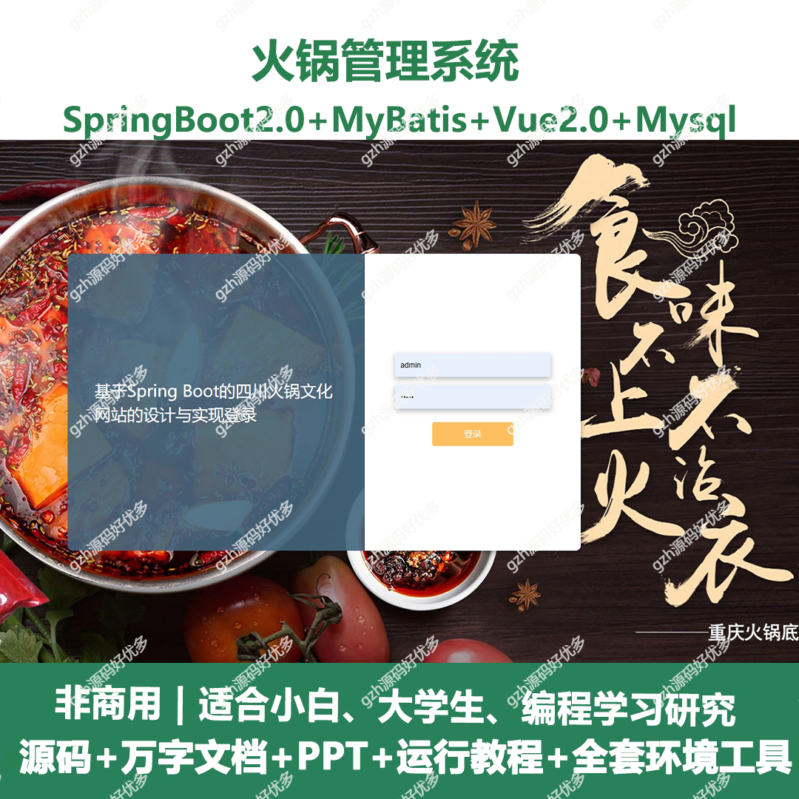
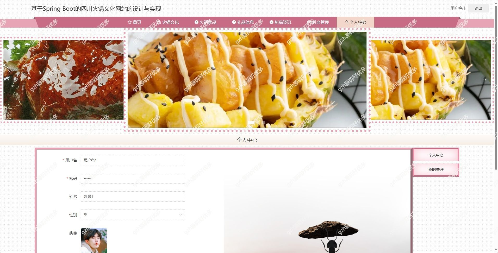
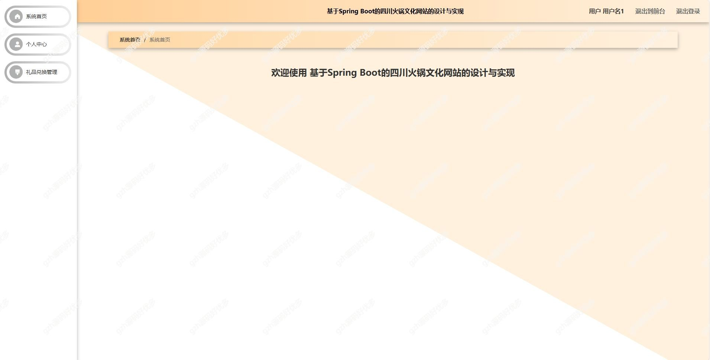
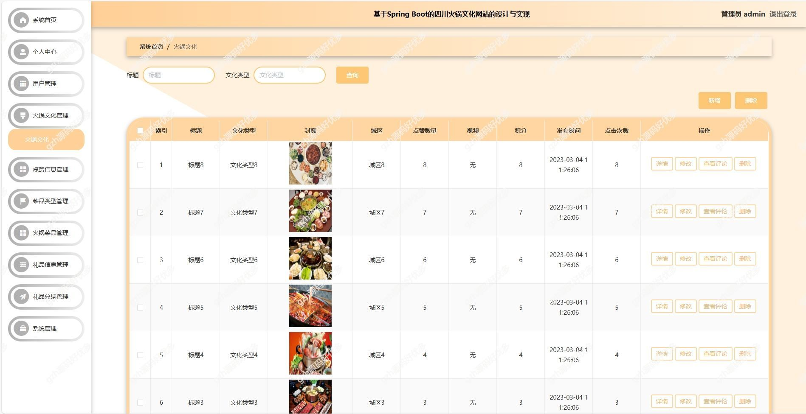
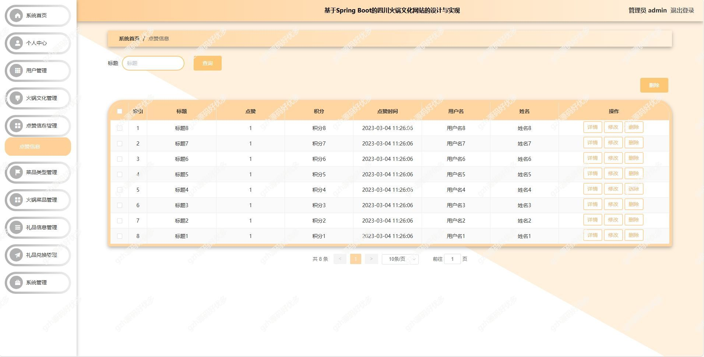
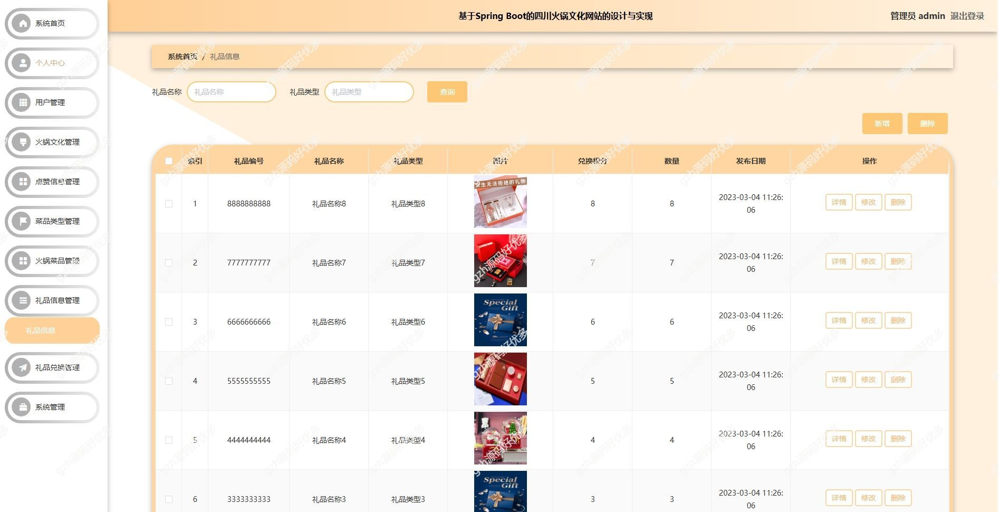
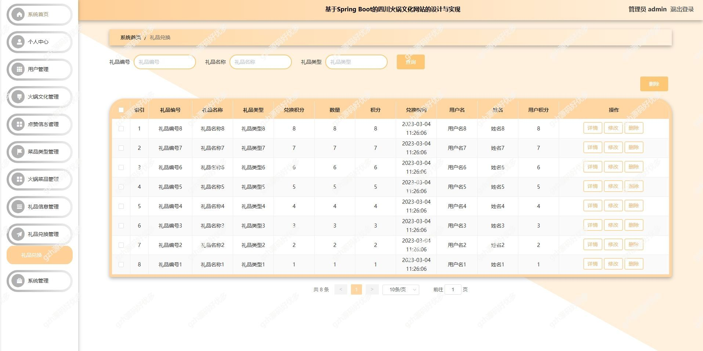
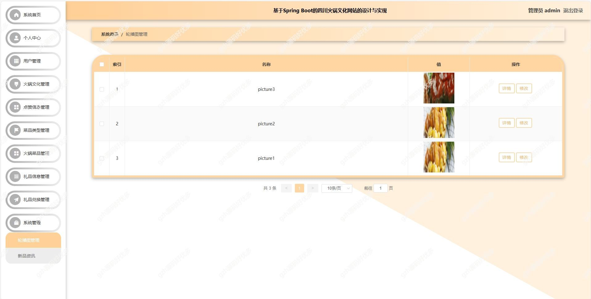

# springbootA306
springbootA306四川火锅文化网站
 
## 查看主页获取源码

### 一、关键词

四川火锅文化网站，四川火锅管理系统

### 二、作品包含
源码+数据库+万字设计文档+PPT+全套环境和工具资源+本地部署教程

### 三、项目技术
前端技术：Vue2.0、Element + Axios、Vue Router
后端技术：Java、SpringBoot2.0、MyBatis

### 四、运行环境（以下版本亲测，其他版本兼容性请自行测试）
开发工具：IDEA/eclipse  + VSCODE

数据库：MySQL5.7

数据库管理工具：Navicat10以上版本

环境配置软件： JDK1.8 + Maven3.6.3

前端Nodejs：14

浏览器：谷歌浏览器

### 五、项目介绍
项目编号：springbootA306

四川火锅文化网站的目的是让使用者可以更方便的将人、设备和场景更立体的连接在一起。能让用户以更科幻的方式使用产品，体验高科技时代带给人们的方便，同时也能让用户体会到与以往常规产品不同的体验风格。

四川火锅文化网站，前台供用户浏览首页、火锅文化、菜品等信息及个人中心操作；后台分管理员和用户端，管理员可进行系统、用户、火锅文化等多类管理，用户能进行系统首页、个人中心及礼品兑换管理 

### 六、运行截图

